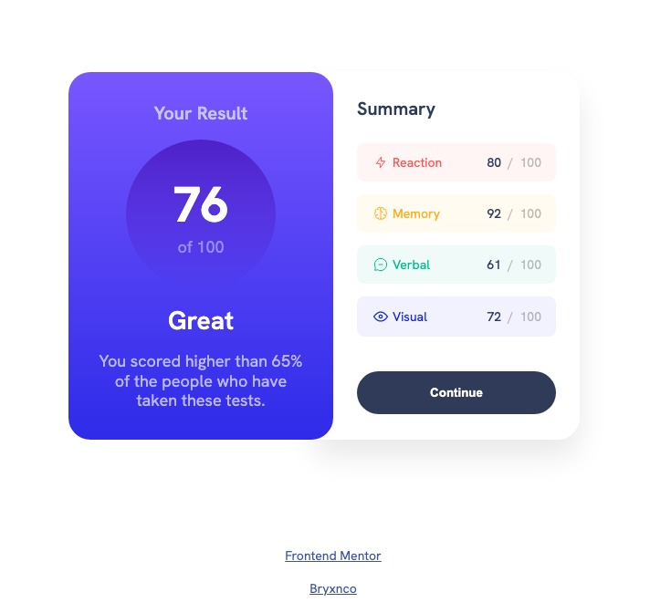

# Frontend Mentor - Results summary component solution

This is a solution to the [Results summary component challenge on Frontend Mentor](https://www.frontendmentor.io/challenges/results-summary-component-CE_K6s0maV). Frontend Mentor challenges help you improve your coding skills by building realistic projects.

## Table of contents

- [Overview](#overview)
  - [Screenshot](#screenshot)
  - [Links](#links)
- [My process](#my-process)
  - [Built with](#built-with)
  - [What I learned](#what-i-learned)
  - [Continued development](#continued-development)
  - [Useful resources](#useful-resources)
- [Author](#author)

**Note: Delete this note and update the table of contents based on what sections you keep.**

## Overview

A simple and nice component which allow the user to view and check a detailed overview of the results of a perfomanced test of habilities.

### Screenshot



_Real Component Screenshot_

### Links

- Solution URL: [Add solution URL here](https://your-solution-url.com)
- Live Site URL: [Add live site URL here](https://your-live-site-url.com)

## My process

### Built with

- Semantic HTML5 markup
- CSS custom properties
- Flexbox
- CSS Grid
- Desktop-first workflow

### What I learned

All along the building of this simple component i used a desktop-first workflow approach keeping my focus on the use of HTML5 semantic markup and good practice of writting CSS rules.

I used a mainly class approach to each tag element used for style the component and try to give a reusable approach to the style used, in order to later if neccessary to, well, actually reuse those for other similar component.

I came up with a type scale on both spacing and font size in order to keep consistency on workflow.

Also used some helper class to not over write come CSS class and actually come up with a cleaner code.

I used some simple but effective media query in order to make the component responsive, which i'm recently learning.

```css
@media (max-width: 34em) {
  html {
    font-size: 56.25%;
  }

  .container {
    margin: 0;
  }

  .result-summary-com {
    grid-template-columns: 1fr;
    min-width: 25rem;
  }

  .result-side {
    border-radius: 45px;
    border-top-right-radius: 0px;
    border-top-left-radius: 0px;
  }

  .summary-side {
    box-shadow: none;
  }
}
```

For the summary side of the component i sed both flexbox and grid for laying out the content.

In the detailed overview of results i used an ul element with li instead of just using nested divs in order to make the layout more semantic.

```html
<ul class="summary-list">
  <li class="summary-item">
    <div class="icon--title">
      <svg
        class="icon"
        xmlns="http://www.w3.org/2000/svg"
        width="20"
        height="20"
        fill="none"
        viewBox="0 0 20 20"
      >
        <path
          stroke="#F55"
          stroke-linecap="round"
          stroke-linejoin="round"
          stroke-width="1.25"
          d="M10.833 8.333V2.5l-6.666 9.167h5V17.5l6.666-9.167h-5Z"
        />
      </svg>

      <p class="title">Reaction</p>
    </div>

    <p class="number">
      <span class="total">80 &nbsp;</span
      ><span class="possible"> &#47;&nbsp; 100</span>
    </p>
  </li>
</ul>
```

### Continued development

In order to keep improving my habilities of course i'm pointing to learn JS and keep practicing my media queries and responsive design.

One of my main take out of this component was the fact that i cannot add animation to a gradient element with just CSS, there are some other ways of doing that so i want to also learn that.

### Useful resources

- [Gradient transition](https://css-tricks.com/transitioning-gradients/) - This helped me to learn that we cannot do transitioning on gradient elements just with CSS.

- [Type Scale](https://type-scale.com) - This is an amazing tool which helped me to came up with a font-size type scale system.

## Author

- Frontend Mentor - [@bryxnco](https://www.frontendmentor.io/profile/bryxnco)
- Twitter - [@lofihopmix](https://twitter.com/lofihopmix)
